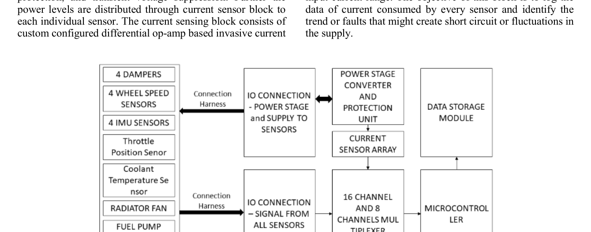

# System Architecture

This document explains the overall system architecture of the FSAE Vehicle Data Acquisition System.

## Design Goal

The goal was to build a low-cost and modular DAQ system that could be installed on an FSAE vehicle to collect real vehicle data during testing. The system was designed to support:

- Driver training analysis
- Powertrain behavior monitoring
- Vehicle-dynamics validation
- Sensor fault detection
- Track-sector comparison
- Final drive ratio tuning
- Post-run CSV-based analysis

## High-Level Architecture

The DAQ system is divided into six major blocks:

| Block | Function |
|---|---|
| Sensor input block | Connects damper, wheel speed, IMU, throttle, coolant, RPM, and other signals. |
| Power delivery block | Distributes regulated supply rails to sensors and electronics. |
| Protection block | Protects the electronics from over-voltage, reverse polarity, transients, and over-current events. |
| Current sensing block | Measures current consumed by sensors and vehicle auxiliaries. |
| Multiplexer block | Expands analog acquisition capacity for many sensor channels. |
| Controller and storage block | Converts signals, applies safety logic, and logs data to CSV. |

## Sensed Parameters

The system was designed to acquire both powertrain and vehicle-dynamics signals.

### Vehicle-Dynamics Parameters

| Parameter | Purpose |
|---|---|
| 4 damper travel sensors | Suspension compression/rebound analysis |
| 4 wheel speed sensors | Wheel slip, speed comparison, drivetrain behavior |
| 4 IMU sensors | Acceleration and gyroscopic measurement near each tire |
| Brake pressure sensor | Braking behavior and driver input analysis |
| Throttle position sensor | Driver demand and powertrain correlation |

### Powertrain and Electrical Parameters

| Parameter | Purpose |
|---|---|
| Engine RPM | Powertrain state and driver shift behavior |
| Coolant temperature | Engine thermal behavior |
| Radiator fan current | Cooling system load monitoring |
| Fuel pump current | Fuel system electrical health |
| ECU supply current | ECU load monitoring |
| Auxiliary current | Electrical subsystem monitoring |
| Battery voltage | Low-voltage system health |

## Controller and Logger Partitioning

The system uses a two-device architecture:

1. **ATmega328-based controller**
   - Reads sensor channels
   - Controls multiplexers
   - Converts ADC values into engineering quantities
   - Performs safety checks
   - Sends structured data frames over serial

2. **Raspberry Pi data logger**
   - Receives serial data through USB/COM port
   - Buffers one complete sensor frame
   - Converts the data into CSV format
   - Creates a new CSV file after each power reset
   - Supports debugging through remote access

## Why This Architecture Was Used

A custom DAQ architecture was selected instead of an expensive commercial logger because FSAE teams often need flexibility. Commercial systems can be powerful, but they may be limited by fixed I/O, cost, sampling constraints, and limited customization for unique vehicle parameters.

This project prioritized:

- Low cost
- Easy sensor expansion
- CSV-based analysis
- Simple firmware updates
- Modular hardware debugging
- Electrical fault monitoring
- Compatibility with student-built race vehicle constraints
