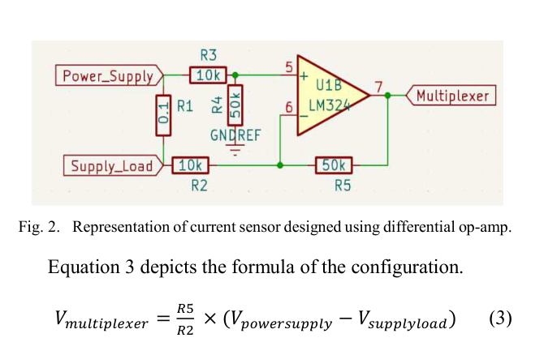
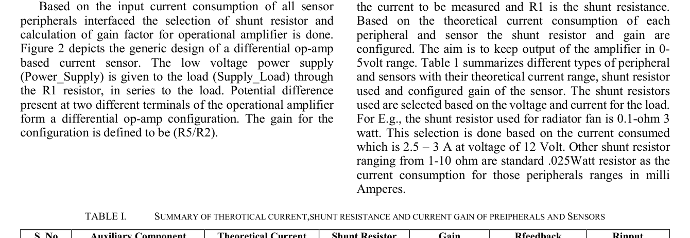
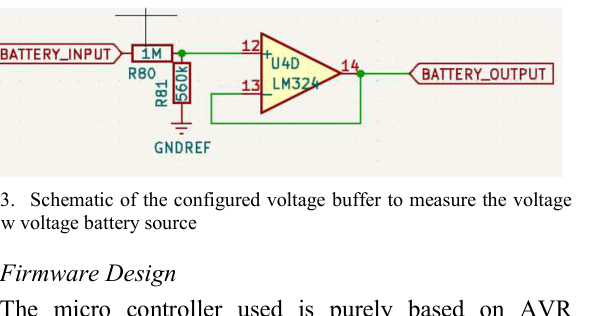

# Sensor Selection and Signal Conditioning

This document explains sensor selection, signal conditioning, op-amp current sensing, voltage sensing, and analog multiplexing.

## Sensor Selection Strategy

Sensors and electronic components were selected based on:

- Operating voltage
- Current consumption
- Mechanical fitment on the vehicle
- Cost and availability
- Compatibility with FSAE packaging constraints
- ADC input range
- Noise sensitivity
- Ease of calibration

## Damper Travel Sensor

A linear potentiometer was used for suspension/damper travel measurement. A 5 V sensor was preferred over a 12 V sensor because it reduces power consumption for the same resistance value.

For a 10 kΩ potentiometer:

```text
At 12 V: P = V²/R = 12²/10000 = 0.0144 W
At 5 V : P = V²/R = 5²/10000  = 0.0025 W
```

The selected damper sensor was a **TE Connectivity MLP-50 style linear potentiometer**, suitable for mechanical mounting and low-current operation.

## IMU Sensor

The IMU sensor was selected based on measurement range, cost, and availability.

| Sensor | Range | Notes |
|---|---:|---|
| ADXL335 | ±3.6 g | Analog accelerometer, higher cost |
| MPU6050 | Up to ±16 g configurable | Lower cost, wider range, selected option |

The MPU6050-type module was suitable because vehicle acceleration during FSAE testing can exceed the range of smaller low-g accelerometers during aggressive maneuvers.

## Current Sensing Design



The current sensing stage uses a shunt resistor and a differential op-amp configuration. The shunt resistor converts load current into a small voltage drop, and the op-amp amplifies this voltage into a measurable ADC range.

The output relation is:

```text
Vout = (Rfeedback / Rinput) × (Vpower_supply - Vsupply_load)
```

Since:

```text
Vpower_supply - Vsupply_load = I × Rshunt
```

the output voltage becomes proportional to the current consumed by the load.

## Current Sensor Configuration Table



| Auxiliary Component | Theoretical Current | Shunt Resistor | Gain | Feedback Resistor | Input Resistor |
|---|---:|---:|---:|---:|---:|
| Wheel speed sensor | 10 mA | 10 Ω | 25 | 249 kΩ | 10 kΩ |
| Damper potentiometer | 1 mA | 10 Ω | 100 | 1 MΩ | 10 kΩ |
| Brake pressure sensor | 4–20 mA | 10 Ω | 25 | 100 kΩ | 3.9 kΩ |
| Radiator fan | 3 A | 0.1 Ω | 5 | 50 kΩ | 10 kΩ |
| Fuel pump | 3 A | 0.1 Ω | 5 | 50 kΩ | 10 kΩ |
| ECU supply | 2.5 A | 0.1 Ω | 5 | 50 kΩ | 10 kΩ |

## Op-Amp Selection

LM324 was selected for current sensing because its common-mode input range was more suitable for low-side and near-ground measurement conditions compared with TL074 in this design context.

## Battery Voltage Sensing



The vehicle low-voltage battery typically operates around 12–14 V during vehicle operation. Since the controller ADC operates in the 0–5 V range, the battery voltage was scaled using a voltage divider and buffered using an op-amp voltage follower.

The buffer prevents the sensor chain from loading the voltage divider and helps provide a stable ADC input.

## Analog Multiplexing

To overcome limited ADC channel availability, analog multiplexers were used:

| Multiplexer | Function |
|---|---|
| CD74HC4067 | 16-channel analog multiplexer |
| CD74HC4051 | 8-channel analog multiplexer |

The controller drives the select lines using GPIO pins and reads the mux output using available analog inputs.

## Sampling Behavior

| Parameter | Value |
|---|---:|
| Sampling rate per parameter | 67 Hz |
| Repeat period per signal | 15 ms |
| Delay between successive data transfers | 1 ms |
| Serial baud rate | 9600 |

This sampling configuration was selected to balance low-cost hardware limitations, data volume, and real vehicle testing needs.
