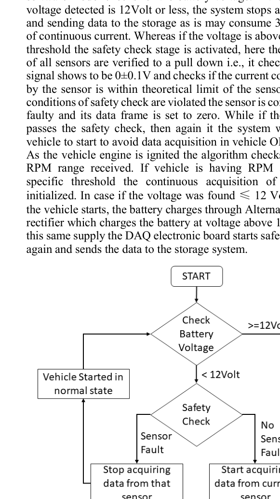

# Firmware and Python Logging Pipeline

This document explains the firmware execution logic, serial communication format, and Python-based CSV data logging workflow.

## Firmware Design Objective

The firmware was designed to acquire sensor data reliably during vehicle operation while avoiding invalid data caused by low battery voltage, disconnected sensors, or out-of-range current consumption.

## Firmware Execution Flow



The firmware follows a staged safety-first execution model:

1. Power is applied to the DAQ board.
2. Battery voltage is checked.
3. If voltage is less than or equal to 12 V, data acquisition is disabled.
4. If voltage is above 12 V, sensor safety checks are performed.
5. Sensor voltage and current are checked against expected limits.
6. Faulty sensor channels are zeroed or ignored.
7. The system waits for the vehicle/engine start condition.
8. Once RPM threshold is detected, continuous acquisition begins.
9. Sensor values are converted into engineering units.
10. Data frames are transmitted to the Raspberry Pi logger.

## Battery Voltage Safety Logic

The system prevents unnecessary current draw when the vehicle is not running or when battery voltage is too low.

```text
if battery_voltage <= 12 V:
    stop acquisition
else:
    run sensor safety checks
```

Once the engine starts, the alternator/charging system raises the voltage above the threshold, and the DAQ board resumes validation and logging.

## Sensor Fault Detection

Each channel is checked for two basic fault conditions:

- Signal does not pull down to expected baseline range
- Current consumption is outside expected theoretical limit

If the channel fails validation, the firmware marks that sensor as faulty and sets its data frame value to zero.

## ADC to Engineering Unit Conversion

The firmware converts raw ADC values into physical parameters.

Examples:

| Sensor | Conversion Output |
|---|---|
| Damper potentiometer | Suspension travel in mm |
| IMU | Acceleration in g |
| RPM input | Engine speed in rpm |
| Current sensor | Current in mA or A |
| Battery divider | Battery voltage in V |
| Temperature sensor | Coolant temperature in °C |

MATLAB models were used to validate the mathematical conversion logic before implementation in embedded C.

## Serial Communication

The controller sends values to the Raspberry Pi through a serial USB/COM connection.

| Parameter | Value |
|---|---:|
| Baud rate | 9600 |
| Sensor repeat period | 15 ms |
| Inter-transfer delay | 1 ms |
| Logger output | CSV file |

## Python CSV Logger

The Raspberry Pi runs a Python logging script that:

- Opens the serial port
- Reads incoming sensor values
- Maintains a list buffer for one complete sensor frame
- Converts the frame into CSV format
- Appends the row to a run-specific CSV file
- Creates a new file after each power reset

## Example CSV Format

```csv
time_ms,damper_fl,damper_fr,damper_rl,damper_rr,accel_x,accel_y,accel_z,rpm,coolant_temp,battery_voltage,fan_current,fuel_pump_current
0,12.2,11.8,30.1,39.5,0.03,0.12,0.98,3000,42.5,13.1,1.2,2.7
15,12.4,12.0,30.3,39.7,0.04,0.16,0.99,3150,42.7,13.2,1.2,2.7
```

## Why Python Was Used

Python was selected for logging because it is simple, reliable, and easy to modify during track testing. It also allows immediate post-processing of CSV data using libraries such as pandas, NumPy, and Matplotlib.
