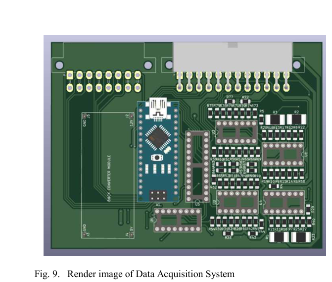

# PCB Design and Power Integrity

This document explains the PCB design methodology, power delivery, protection circuits, current paths, and track-width planning.

## PCB Design Tool

The PCB was designed using **KiCad 6.0**.

The workflow included:

1. Schematic design
2. Breadboard-level validation
3. MATLAB model validation for conversion logic
4. Netlist generation
5. PCB layout
6. Track-width sizing
7. Connector placement
8. Manufacturing constraint checks
9. PCB render review

## PCB Render

The PCB integrates:

- ATmega328-based development board
- Power conversion section
- Analog multiplexers
- LM324 op-amp stages
- Current sensing resistors
- Sensor connectors
- Data storage interface
- Protection components

## Power Rails

The DAQ board supports multiple supply levels because different automotive sensors use different voltage domains.

| Rail | Purpose |
|---|---|
| 12 V | Wheel speed sensors, high-current peripherals, vehicle battery interface |
| 5 V | Controller ADC-compatible sensors and logic |
| 3.3 V | Low-voltage sensor/peripheral support |

The 12 V to 5 V conversion was implemented using an XL4015 buck converter module rated for continuous current delivery up to 5 A.

## Protection Circuits

The board includes protection against:

- Reverse polarity
- Over-voltage
- Over-current
- Automotive transient voltage events
- Sensor short circuits

A TVS diode such as SA12A was used for transient voltage suppression on the low-voltage supply path.

## Track-Width Planning

PCB trace width was selected based on current demand and IPC2221-style external-layer calculations.

| Track Width | Current Capacity |
|---:|---:|
| 0.500 mm | 2.5 A |
| 1.27 mm | 4.5 A |
| 3.00 mm | 9 A |
| 5.00 mm | 12.5 A |

High-current paths above 5 A were routed as wider copper patches where possible.

## Noise Reduction Considerations

The board was designed with awareness of the noisy automotive environment. The following design choices were used:

- Separate power and signal routing where practical
- Wider tracks for high-current loads
- Multiple vias across high-current traces
- Buffered battery sensing
- Current sensing before sensor distribution
- Mux-based routing to minimize long analog traces
- Pull-down validation in firmware for disconnected sensors

## Power and Signal Integrity Concerns

The DAQ system operates near ignition, radiator fan, fuel pump, ECU, and auxiliary electronics. These loads can introduce noise, current spikes, and supply dips.

To improve reliability, the design monitors current consumption of each major peripheral and uses sensor-current trends to identify faults or abnormal behavior.

## Bench Validation Before Vehicle Testing

Before full vehicle testing, the board-level design was checked through:

- Continuity testing
- Power rail measurement
- Sensor output checks
- ADC scaling checks
- Current sensor calibration
- Serial data verification
- CSV logging validation
- MATLAB comparison for conversion equations
