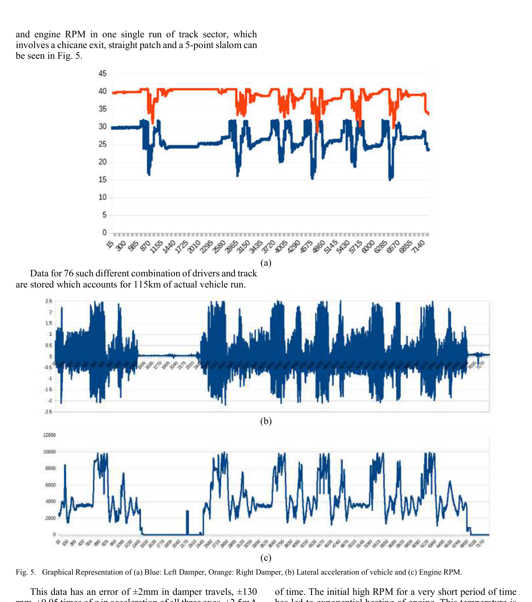
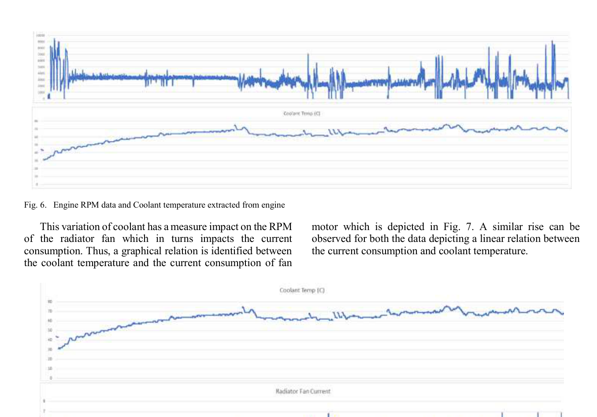
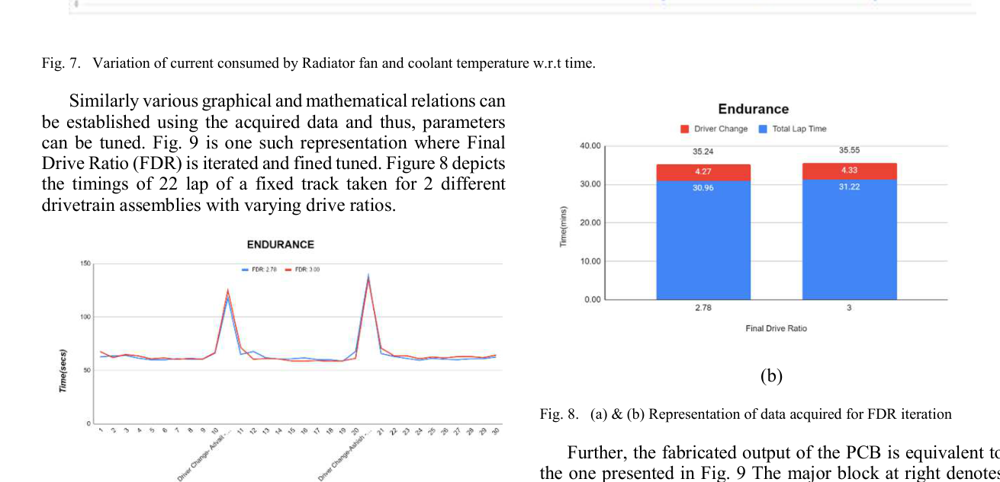

# Testing, Results, and Validation

This document summarizes vehicle testing, measurement accuracy, logged data, and interpretation of the acquired FSAE vehicle signals.

## Test Coverage

The DAQ system was validated on the vehicle during actual testing.

| Metric | Value |
|---|---:|
| Total vehicle test distance | 115 km |
| Driver/track combinations | 76 |
| Sampling rate per parameter | 67 Hz |
| Data format | CSV |
| Test use cases | Driver training, track-sector analysis, powertrain monitoring, FDR iteration |

## Track Data Example

The logged run includes:

- Rear left and rear right damper travel
- Lateral acceleration
- Engine RPM
- Chicane exit behavior
- Straight patch behavior
- Five-point slalom behavior

This data helps the team correlate driver input, vehicle response, and powertrain behavior over real track sections.

## Measurement Accuracy

The system was manually validated using reference readings or ECU data where available.

| Parameter | Observed Error |
|---|---:|
| Damper travel | ±2 mm |
| Engine RPM | ±130 rpm |
| Acceleration | ±0.05 g |
| Current sensing | ±2.5 mA |
| Voltage sensing | ±50 mV |
| Throttle position | ±6% |
| Coolant temperature | ±3 °C |

## Engine RPM and Coolant Temperature

The acquired data shows the relationship between engine RPM and coolant temperature during a run. A short high-RPM event caused rapid temperature increase, followed by temperature stabilization as the engine settled into a more consistent RPM band.

This result helped validate the system's ability to capture thermal and powertrain behavior under high-temperature real vehicle conditions.

## Radiator Fan Current vs Coolant Temperature

The fan-current data was compared with coolant temperature to identify the relationship between thermal load and electrical load. As coolant temperature increased, the radiator fan current behavior showed corresponding variation.

This type of data is useful for:

- Cooling system validation
- Fan current monitoring
- Electrical load analysis
- Fault detection
- Battery load estimation

## Final Drive Ratio Iteration

The DAQ system was used to compare different final drive ratio configurations over fixed track runs.

The analysis included:

- Lap timing comparison
- Driver-change timing
- Track-sector consistency
- FDR impact on endurance behavior
- Powertrain response across repeated laps

This demonstrates how DAQ data can support design decisions beyond basic logging.

## Validation Methodology

The system was validated through multiple layers:

1. **Bench-level validation**
   - Sensor voltage range checks
   - Current sensor calibration
   - ADC conversion checks

2. **Firmware validation**
   - Battery threshold logic
   - Sensor fault detection
   - Serial frame format

3. **Python logger validation**
   - CSV row integrity
   - Frame buffering
   - File creation after reset

4. **Vehicle validation**
   - 115 km real-world testing
   - Multiple driver/track combinations
   - Comparison with manual readings and ECU data

## Key Result

The implemented system successfully acquired and logged vehicle powertrain and dynamics data with minimal communication delay, acceptable sensor error margins, and useful track-level performance insights.
